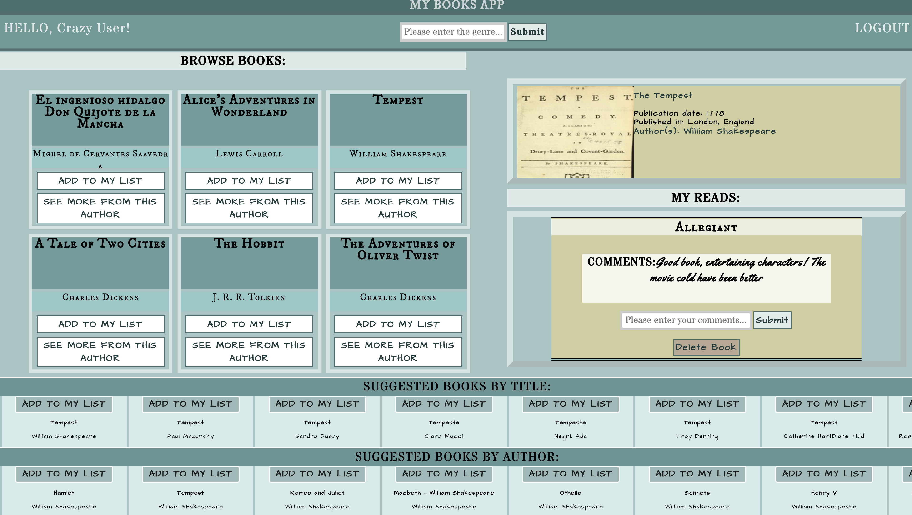
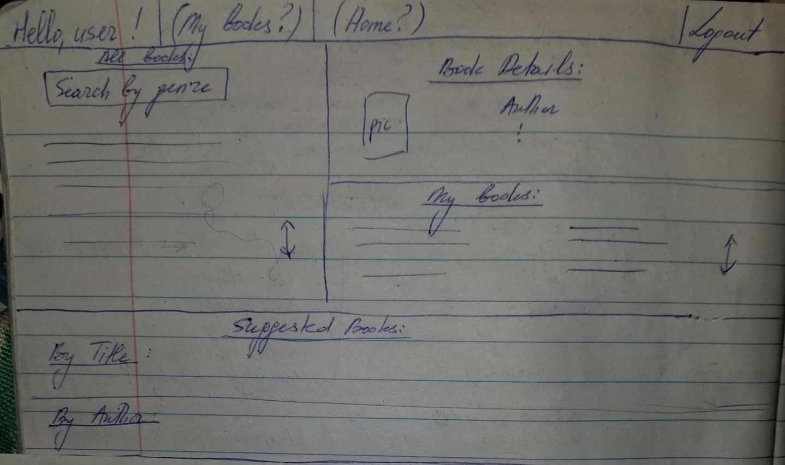

# project4 
## Book App: Description
The book app lets the user browse through a variety of books, add the books they have read or are in the process of reading to their list, view details for a particular selection, and comment on the book.  Moreover, the app makes book recommendations based on the title or the author of the book the user is currently viewing.
## Screenshot of the App

## Technologies Used
To create this app, I have used JavaScript, HTML/CSS, React (with React Hooks), MongoDb, Node.js, and Express.  The application backend was built using Express; the front-end was created using React.  All the styling was accomplished using CSS.  

The app utilizes JWT authentication and uses two related models: user and book via one-to-many relationship.  All of the needed user and book information is saved in the mongo database.  The application includes all major CRUD functions for a book model -- the user is able to create, read, update, and delete books from their respective book lists. 
## General Approach
The general approach toward creating this application consisted of first finding a reliable external API for the purposes of searching the available books.  I have used Open Library API for this project: [https://openlibrary.org/developers/api](//https://openlibrary.org/developers/api).  

I have then used Express to create restful routes at the backend of the application to support the CRUD functions for the book model.  Once those were built, I used React to render the information on the front-end.  I have then styled the page using CSS (the screenshot of the wireframe is available below).  For this app, I have chosen to render all of the information on a single page.

